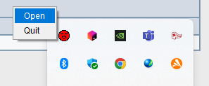
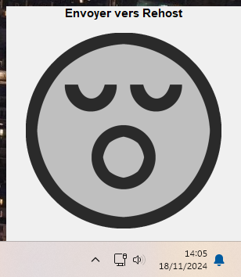
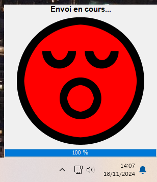
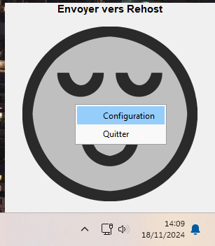
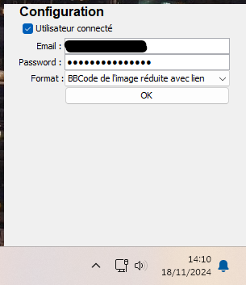

# Send to Rehost - Systray

**Send to Rehost** est une application légère qui permet de transférer facilement des images vers `rehost.diberie.com` directement depuis la barre système (systray) de Windows.

---

## Comment utiliser
1. **Télécharger l'archive**: [https://github.com/flaiehfr/send-to-rehost-systray/releases/download/v1/send-to-rehost.jar](https://github.com/flaiehfr/send-to-rehost-systray/releases/download/v1/send-to-rehost.jar)
2. **Version de Java**: Il vous faut une version de Java 11 minimum, plus récent c'est mieux 
3. **Démarrez l'application** : En double cliquant sur le fichier `send-to-rehost.jar`, ou depuis une ligne de commande `java -jar send-to-rehost.jar`. L'icône apparaîtra dans le systray Windows.
4. **Déposez vos images** : Faites glisser vos fichiers dans la fenêtre ouverte.
5. **Récupérez les résultats** : Une fois l'icône revenue à son état initial, le résultat se trouve dans votre presse-papier.
6. **Collez sur HFR**

---

## Fonctionnalités principales

### Interface dans le systray
L'application s'intègre au systray Windows avec un redface reconnaissable :

---

### Envoi d'images simplifié
Lorsque vous double-cliquez sur l'icône du systray (ou click droit puis `Open`), une fenêtre s'ouvre pour vous permettre de déposer vos images (`jpg`, `jpeg`, `png`, `gif`) :

Après avoir déposé vos fichiers, ils sont automatiquement envoyés sur `rehost.diberie.com`.

Pendant le processus, l'icône change de couleur pour indiquer l'état de l'envoi. 

Une fois terminé, le résultat (URL ou autre) est automatiquement copié dans votre presse-papier, prêt à être collé sur HFR.

---

## Configuration

L'application offre des options de configuration accessibles via un clic droit sur l'icône dans le systray :

### Options disponibles
- **Mode d'envoi :**  
  Vous pouvez choisir entre un mode **connecté** ou **anonyme** :
    - **Mode connecté :** renseignez votre email et mot de passe pour utiliser votre compte `rehost.diberie.com`.
    - **Mode anonyme :** aucun identifiant n'est requis, décochez la case *Utilisateur connecté*

- **Format des résultats :**  
  Configurez le format du contenu copié dans votre presse-papier après l'envoi (URL ou autre), parmi:
    - URL de l'image pleine
    - BBCode de l'image pleine
    - URL de l'image réduite
    - BBCode de l'image réduite avec lien
    - URL de l'image miniature
    - BBCode de l'image miniature
    - BBCode de l'image miniature avec lien

En cas d'upload multiple, chaque résultat sera séparé par une nouvelle ligne.

### Envoi de GIF

Dans le cas des GIF, rehost ne les redimensionne pas, et renvoie uniquement l'URL. Selon le format choisi dans la configuration,
le résultat dans le presse-papier sera soit l'URL soit le BBCode.

### Sauvegarde des paramètres
Une fois vos modifications effectuées, cliquez sur **OK** pour les sauvegarder. La configuration est automatiquement appliquée pour les prochains lancements de l'application.

